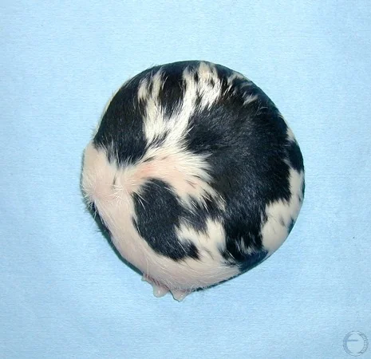

In physics there is an old joke:
> First assume a spherical cow...

The joke pokes fun at the way physicists solve problems. We make a lot of simplifying assumptions like "uniform density", "no air resistance", and "object is a sphere". Some of the starting assumptions might sound ridiculous, but they often produce surprisingly accurate results.

The philosophy is simple: start with the simplest possible model, then only add complexity when it is actually needed. There is no reason to make a model more complicated if a simpler one already works. In many ways, this "spherical cow" mindset is similar to [Lean Startup](https://theleanstartup.com/) theory. Build the minimum viable product first, then iterate only where reality demands it.

But here is the funniest part: it turns out spherical cows actually exist in real life!

It is called an [Amorphous Globosus](https://en.wikipedia.org/wiki/Amorphous_globosus), a rare bovine birth defect where a malformed fetus develops into a roughly spherical mass. They are not viable cows, but they are cows nonetheless. And they are spherical!

So maybe "spherical cow" is not such a ridiculous assumption after all.

