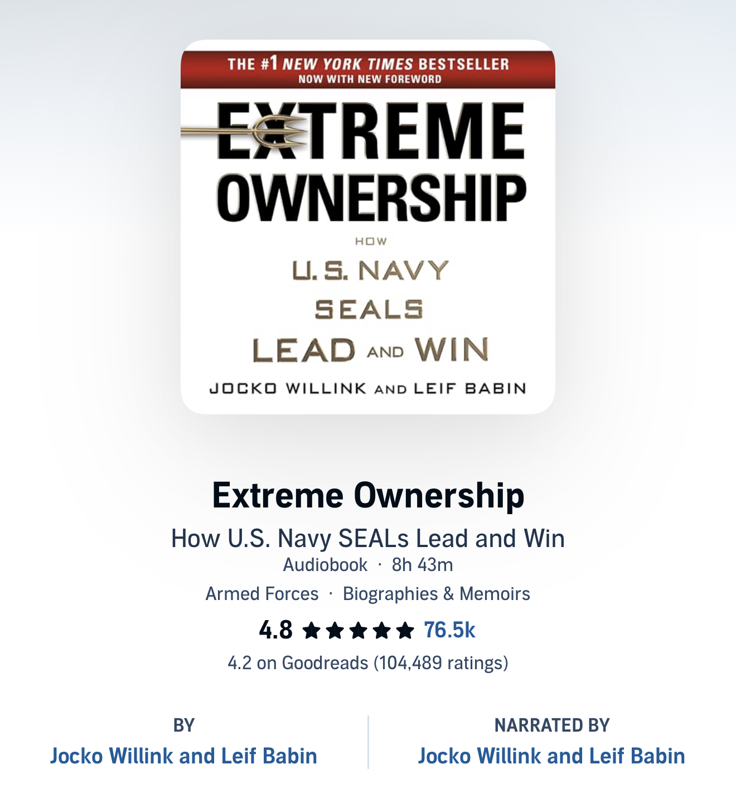

I recently finished listening to [*Extreme Ownership*](https://a.co/d/0b8Ou8lL) by Jocko Willink and Leif Babin. As I've started taking on more leadership responsibilities at work, I wanted to spend some time learning from people who have led under truly high-pressure situations. This ended up being one of my favorite self-improvement books I've ever read!

The book is written by two U.S. Navy SEAL officers who commanded troops during the Battle of Ramadi in Iraq. It is part war story, part leadership book, and I found the combination extremely engaging. I listened to the audiobook, which made the stories even more immersive since the narrators sound exactly like the battlefield commanders in the movies.

The book is organized around twelve leadership principles that the authors developed and refined while leading combat missions. Each principle is presented through two real-world examples: first a story from the battlefield, then a story showing how the same idea applies in business. I won't try to summarize those principles here because the authors do an excellent job themselves, and honestly, you should probably read the book for yourself.

Instead, I wanted to share three broader themes that I found myself thinking about after I finished the book.

## Theme 1: The Military May Be the Best Place to Learn About Leadership

One realization I had while reading this book is that there is probably a reason people still read *The Art of War* despite the fact that warfare has changed almost beyond recognition since it was written. War is probably humanity's oldest large-scale organizational challenge. For thousands of years people have been refining how to coordinate teams, communicate under pressure, plan operations, allocate resources, and adapt to constantly changing situations. Those same skills happen to be fundamental to almost every modern profession.

Reading *Extreme Ownership*, it became obvious that although the setting was combat, the underlying lessons had almost nothing to do with combat itself. Nearly every principle applied equally well to engineering teams, startups, research labs, or really any organization trying to accomplish difficult goals. After finishing the book, I found myself wanting to read more military history and leadership books. Not because I'm interested in warfare itself, but because it seems to be one of the richest sources of practical leadership lessons ever developed.

## Theme 2: Take Every Advantage

One idea that repeatedly appeared throughout the book wasn't listed as one of the official leadership principles, but I found myself noticing it over and over again: the authors constantly emphasized going into every mission with **every possible advantage**.

During their deployment, they described their SEAL teams as some of the most highly trained, best equipped military units in history. At the same time they described the enemy as a rag-tag force of poorly trained and outfitted militants. The SEALs possessed enormous advantages in training, equipment, planning, and intelligence over their opponents. Yet despite all of those advantages, they never became complacent. Every mission was planned with extraordinary care. Equipment was checked repeatedly. Contingencies were discussed. Worst-case scenarios were considered, even if they seemed unlikely. They still looked for every possible edge before stepping outside the wire.

This reminded me of something I frequently heard in my startup days. Investors would often ask, "What's your unfair advantage?". The first time I heard that phrase, I thought it sounded almost mean. Shouldn't we be trying to make the world more fair? But over time I realized what they actually meant.

Success is difficult. Failure is common. Genuine advantages are rare. If you happen to possess some advantage,-- whether that's unique expertise, better technology, a great team, or simply more preparation -- it makes little sense not to use it. If your goal is to accomplish something meaningful, you should make success as easy as possible for yourself.

## Theme 3: Communication Is Something You Practice

Many of the leadership principles in the book revolve around communication. The SEALs have developed methods of communicating that minimize misunderstandings while still allowing individuals to act independently. Communication is fundamental to any organization, which makes these lessons surprisingly universal.

The core of their communication philosophy seems to be twofold. First, simplify what you say so the other person receives exactly the information they need without getting lost in unnecessary detail. Second, trust that the other person understands the mission well enough to fill in the gaps and make good decisions on their own. If you think about it, this is really a human version of a compression algorithm. Compression works because both the sender and receiver share enough information to reconstruct what has been omitted. Likewise, through extensive training and shared experience, the SEALs develop enough common understanding that they can communicate an incredibly complex situation with just a few words, confident that the other person can infer the missing details and act predictably.

While the authors present several practical techniques for improving communication, I think the deeper lesson is that communication itself is a skill that must be practiced between people. Moving forward, instead of becoming frustrated when someone misunderstands something I say, I want to treat it as an opportunity to improve how we communicate with one another and build that shared understanding over time.

## Conclusion

Overall, I highly recommend [*Extreme Ownership*](https://a.co/d/0b8Ou8lL). It's entertaining, practical, and full of memorable stories. If you end up reading it, pay attention not only to the twelve leadership principles, but also to the broader patterns that emerge between them. I suspect you'll come away with a few lessons of your own!