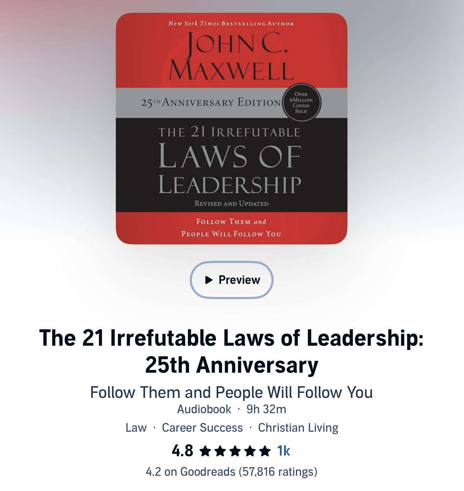

I just finished listening to ["The 21 Irrefutable Laws of Leadership"](https://www.goodreads.com/en/book/show/815716.The_21_Irrefutable_Laws_of_Leadership) by John C. Maxwell. Overall I thought it was a good book. A lot of the advice felt familiar, but that is likely because other books and articles derive a lot of advice from this book.

I won't go into detail about all 21 laws, but I will highlight the top two laws that I found the most impactful for me: The Law of Process and The Law of Empowerment. Both of these laws are about developing skills, where the Law of Process is about developing your own skills and the Law of Empowerment is about developing the skills of others. It was great to hear from John C. Maxwell, who is regarded as a leadership expert, that leadership is a skill that can be developed over time and taught to others.

One thing I liked was what the author called "Leader's Math". Basically the idea is that if you lead a team of followers, you are able to multiply your impact by the number of people you lead. But if instead of leading a team of followers, you empower the people you lead to become leaders themselves, then you can multiply your impact by the number of people you lead and the number of people they lead, and so on. I love this analogy, because it illustrates a great point about why it's important to invest time in developing the skills of others, though I will say it's not directly relevant to formal leadership positions, where the org structure is set.

Overall I liked this book, but I will say it's more geared to teaching abstract principles of leadership rather than providing practical advice for specific situations. If you’re looking for concrete advice on handling difficult conversations or managing specific situations, [Extreme Ownership](https://shep4.com/blog/2026/06/book-review-extreme-ownership/) is still my go-to. But if you’re looking for a solid introduction to the core principles of leadership, I think The 21 Irrefutable Laws of Leadership is a worthwhile read.

