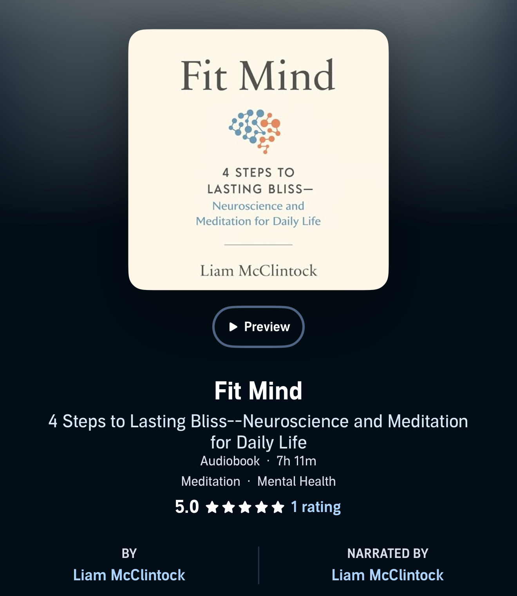

[FitMind](https://fitmind.org/)

I just finished listening to [FitMind by Liam McClintock](https://fitmind.org/book). I have been a fan of Liam and FitMind for some time now. I used the [FitMind App](https://fitmind.org/) a few years ago during my PhD program to help reduce stress and improve my concentration while defending and writing my dissertation. I'm so excited that he finally wrote this book!

There is a lot to say about meditation. It has a spiritual dimension, with many people practicing it as part of a religious tradition. It also has a scientific dimension, offering a way to examine how the mind works, and a health dimension, with lots of research suggesting that meditation has a positive impact on health. FitMind does a great job of exploring meditation from each of these perspectives.

What I like most about FitMind is that it distills meditation principles into practical techniques that are accessible to everyday people—without requiring lengthy retreats or a major change in lifestyle. Big picture, the goal is just to remain somewhat meta-aware of our own thoughts and recognize when we are engaged in mentally fit and unfit behavior. Mentally unfit behavior is stuff like doomscrolling, caving in to negative cravings, losing focus, and any sort of negative trait that we don't want to reinforce. And mentally fit behavior is basically just being happy and engaged. By remaining meta-aware, we can catch ourselves when we drift into mentally unfit states and redirect our thoughts to more positive vibes.

After explaining a lot of background and the science behind meditation, Liam lays out the 4 Rs, a simple way to maintain mindfulness throughout our day-to-day lives:

**Recognize:** Whenever we realize that we are engaging in mentally unfit behavior, instead of scolding ourselves, we instead thank ourselves for becoming aware of the unfit behavior.

**Release:** We release the unfit thought by not feeding it anymore and instead directing our attention to the fit mental states that we would prefer to engage with.

**Relish:** After shifting our thoughts to more positive vibes, we take a moment to feel happy about it. By actively choosing to feel good after redirecting ourselves away from unfit states and towards fit ones, we are training ourselves to do this more easily and more often.

**Remain:** We try to remain focused and present in the fit states, realizing that eventually we will get distracted, but when we do, we can simply repeat the 4 Rs again!

This is just a high-level overview. If you want to learn more, I suggest you read [FitMind](https://fitmind.org/book). Overall, I highly recommend this book.