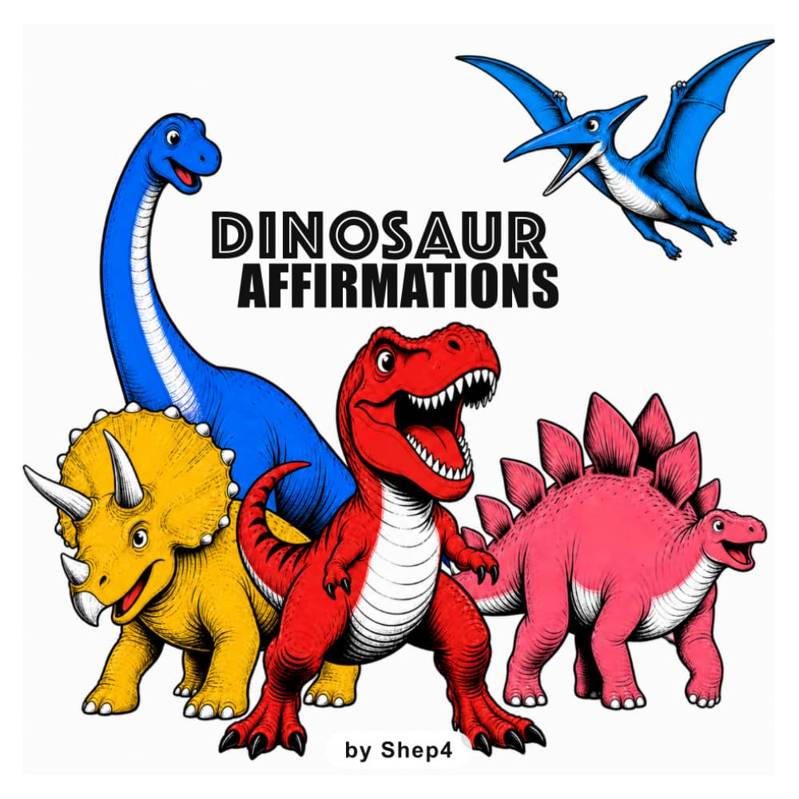

Last week I restarted [Project Zero Inventory](https://shep4.com/blog/2026/08/project-zero-inventory-w5/) and promised that this week I would have a real product to show...

... and this time I do! Though it is a bit different than what I originally planned.

## My First Product: Dinosaur Affirmations: ROAR!

Without further ado, let me present my first zero-inventory product: [Dinosaur Affirmations: ROAR!](https://www.amazon.com/Dinosaur-Affirmations-ROAR-Shep4/dp/B0HDHSZD64/)

This is a book I wrote for my son. It's basically a bunch of cool pictures of dinos paired with affirmations like "I am strong! ROAR!" My son loves dinosaurs, and he loves to roar, so this is the perfect book for him.

I self-published this book using Amazon's Kindle Direct Publishing (KDP) platform. This is a print-on-demand dropshipping product, meaning that I don't need to worry about inventory nor logistics. If someone purchases a book from Amazon, Amazon will print the book for that order, then ship it to them directly.

## Why a kids book?

Now if it seems completely random that I am launching a kids book, thank you for paying attention to my branding up this point. Yes, this is somewhat of a departure from my physicist, innovator, AI-engineer, builder-in-public website. But it also fits squarely in with what I am doing, especially with regard to [Project Zero Inventory](https://shep4.com/blog/2026/07/project-zero-inventory-w1/).

There are three main reasons why a kids book is a great first product:

1) I was already writing kids books for my son. I love writing stories with my son in mind. Giving him a gift that I spent a lot of time on gives me great joy. And by writing these books myself I can make them educational and filled with values I want to instill upon him. I hope that by writing lots of books for him over the years I can slowly brainwash him into becoming a kind, strong, self-confident, young man one day.

2) The Amazon KDP model is perfect for the zero inventory model I want to implement. The barrier to entry for self-publishing books is surprisingly low. There is literally a $0 upfront cost, and I do not have to juggle shipping logistics.

3) Writing kids books is fun! This is something I enjoy doing and I can realistically continue doing for the foreseeable future.

## How did I make this book?

Well my son has been going through a dinosaur phase where he stomps around the house like a T-Rex and roars at people. I thought it would be fun to have a book that uses that energy to build self-confidence. So I basically just wrote down some affirmations and used AI to generate some cool dinosaur images to go along with them.

Once I had all the text and images in place, I formatted the book as an HTML document. I tried out some GUI-based software like Canva for this, but ironically I found it easier to just use raw HTML for everything. HTML code makes more sense to me than the Canva GUI, plus making an HTML document is free and I was able to lean heavily into coding agents to make edits and add in the boilerplate pages.

Once I had the HTML document, it was extremely easy to publish it on KDP. It honestly might have taken less than an hour, including all the time I spent figuring out what each field in the submission form meant.

## Next steps

Making a kids book for my son and publishing it on KDP was a fun project. This first book took a while to make, but now I have a repeatable template and workflow I can use for future book ideas as they come up. Overall this is a repeatable and sustainable process I can do each time I come up with a new book idea for my son.

That being said, I don't anticipate this is going to be a huge revenue generator. The extremely low barrier to entry for self-publishing means that the competition is astronomical. I'm also using AI-generated images, which lowers the demand for my books. There is an angle that maybe if I lean into my science background and write science books for kids then maybe that could take off, but honestly, I also can't see myself going on book tours to local libraries to read my books to kids. I anticipate I'll sell a few copies to friends and family, but I'm not going to expect much more than that.

Overall, I think making kids books is a fun project I will do somewhat frequently, posting them here on my website as I make them. But my main motivation for this will be personal, not business.

Next week though, I plan to have actual progress on the 3D printed products. Stay tuned for more in this direction!