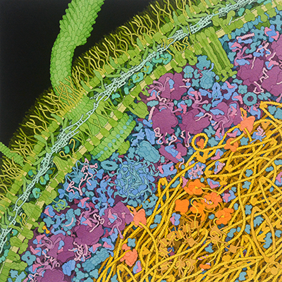

This week I want to do something a little bit different. Instead of writing about physics or coding, I want to simply highlight the work of a scientist / artist that I really like: [David S. Goodsell](https://ccsb.scripps.edu/goodsell/). 

Goodsell paints beautiful illustrations of the molecular structures inside cells. What makes his work so incredible is that he is drawing things nobody can actually see!

Unlike an artist drawing a landscape or a bowl of fruit, Goodsell cannot simply look at his subject and paint what is in front of him. Cells are transparent. Instead, he has to rely on papers and experiments that reveal the individual parts of cells, where they are located, and how they interact with each other. Goodsell brings all of that scattered information together into a single picture of an otherwise invisible world.

That is an extremely difficult thing to do!

Actually, Goodsell's art helped me a lot during my PhD. A core part of my PhD involved developing machine-learning methods to analyze experiments in biophysics, which meant I had to learn a lot of molecular biology. Reading textbooks and looking at diagrams helped me understand biological processes at a theoretical level, but Goodsell’s paintings make them feel real. When I looked at one of his illustrations, concepts like molecular crowding suddenly click. I would spend an hour reading a textbook then look at one of his images and say, “Oh, that’s what molecular crowding means!”

Here is one example of my favorite piece by him:

I love how clearly you can see the flagella of the bacterium and how dense and chaotic its interior is. But on an artistic level, I also love the contrast between the black background and the vibrant orange inside the cell. The illustration is informative, but it is also genuinely beautiful.

I highly recommend exploring the Goodsell [gallery](https://pdb101.rcsb.org/sci-art/goodsell-gallery) to see more of his work!

I love when science and art come together like this. Art helps us understand parts of the universe that we cannot see, while science gives us entirely new worlds to visualize. If you know of any great scientific artists, please let me know!

