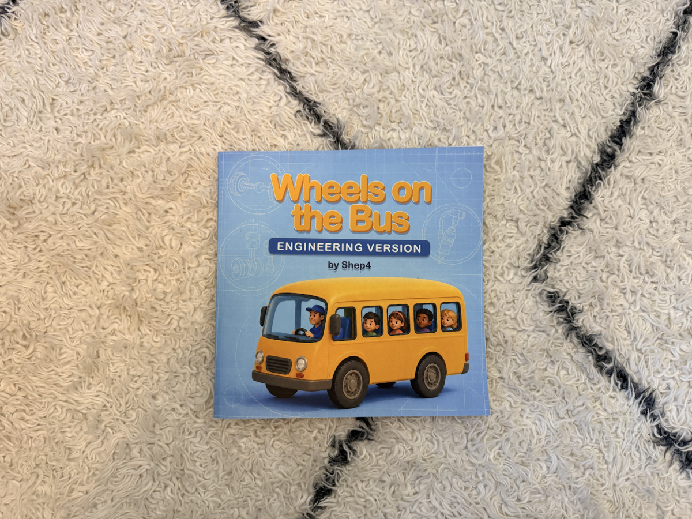
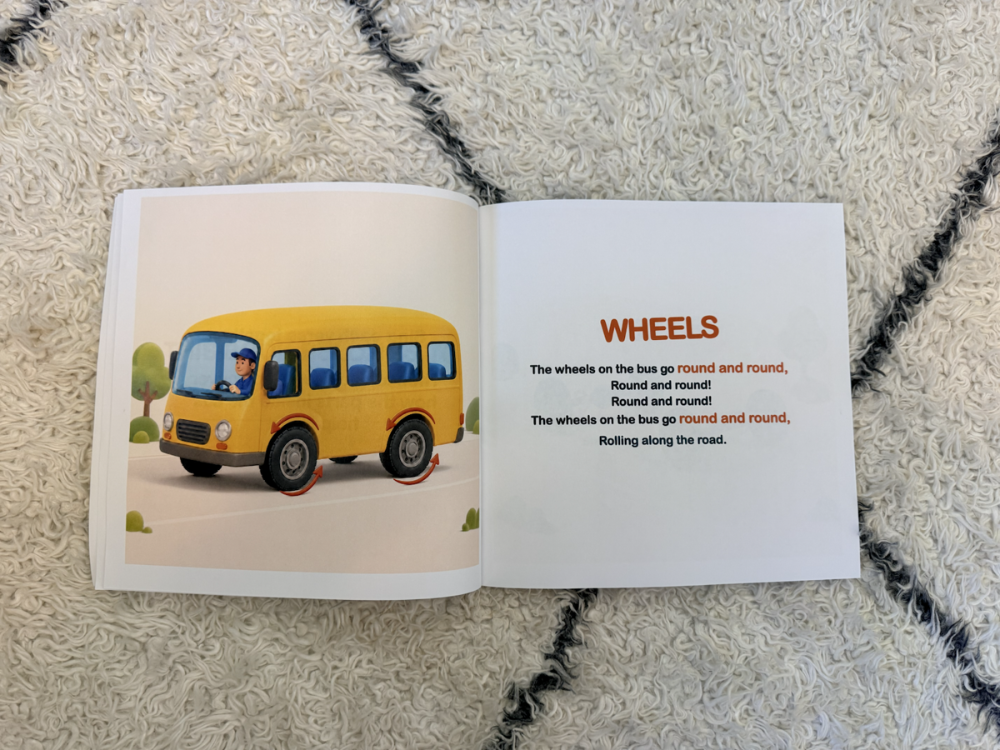
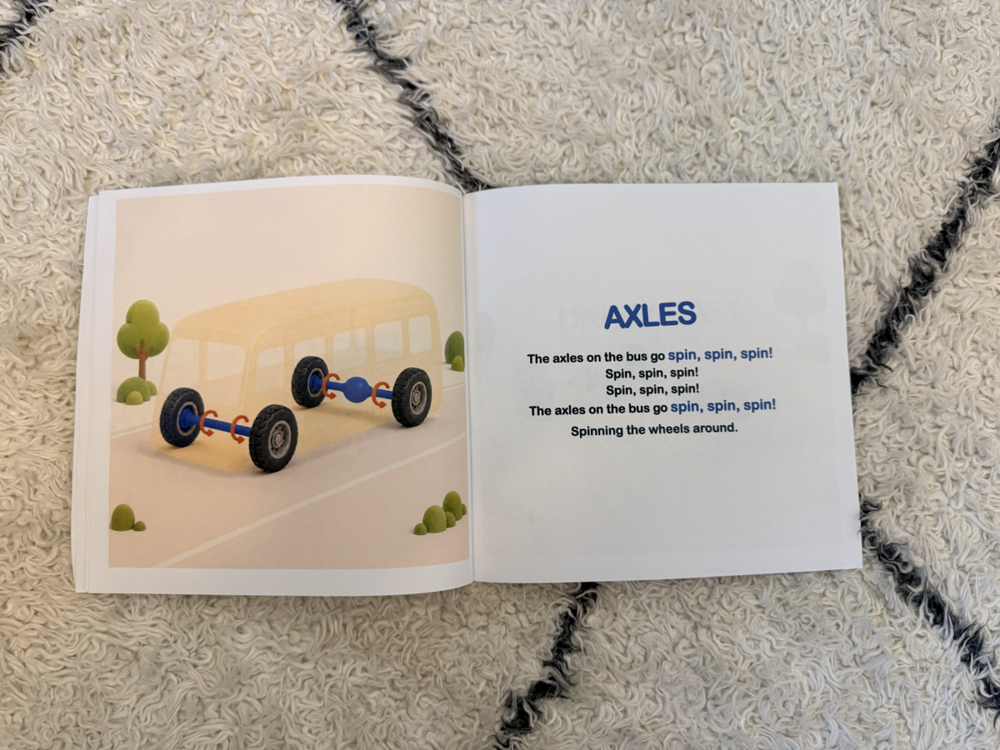
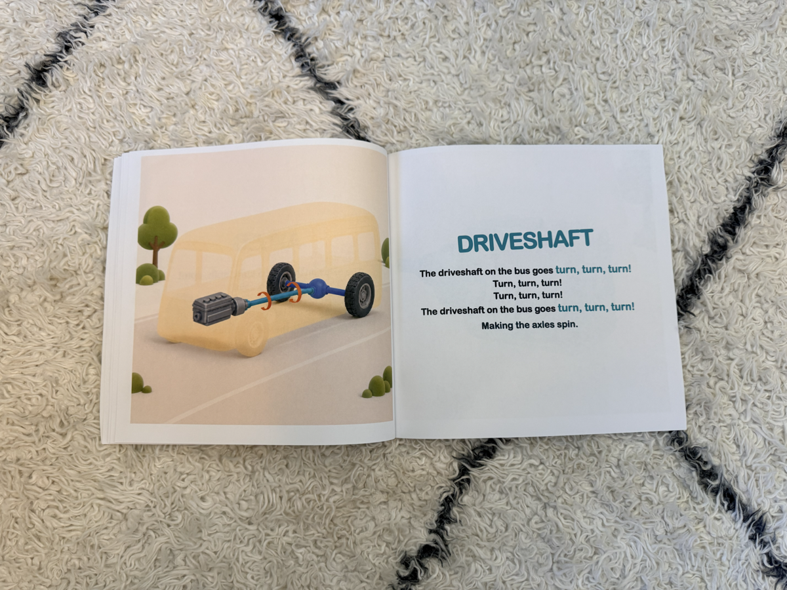

Last week I shared the first product from [Project Zero Inventory](https://shep4.com/blog/2026/08/project-zero-inventory-w6/) and promised that this week I would have actual progress on the 3D printed products.

And I do!

Though I still don't have anything printed...

## A Shift in Strategy

Over the last few weeks, my initial hypothesis that 3D printing could be a low-cost way to establish product-market fit has been severely challenged by the logistics of printing my designs on a printer I do not own.

I have been relying on a friend's printer, but coordinating schedules and getting access to the printer has taken much longer than I expected. This isn't a major problem while I'm experimenting with prototypes, but extrapolating long term, I started to worry about what would happen if I actually began selling these products.

If someone purchased something from my store, I wouldn't want them to wait a few weeks while I figured out when and where I could print it. That would be a terrible customer experience, and it certainly wouldn't be a sustainable way to run a business.

But behold, I found a solution!

The solution was inspired by my recent success publishing kids books through Amazon's print-on-demand service. It also seems completely obvious in hindsight.

## On-Demand 3D Printing

Rather than printing the products myself, I can use an on-demand 3D printing and dropshipping service.

I found several companies that will handle both the manufacturing and shipping logistics. All I need to do is design the product, upload the 3D model, and connect the service to my online store. Then, whenever someone purchases the product, a third-party vendor will print it and ship it directly to the customer.

This is almost exactly the same model I am using for my books. I can create and sell a physical product without purchasing inventory, owning manufacturing equipment, or handling the shipping myself. In fact, it fits the original goal of Project Zero Inventory even better than relying on a friend's printer.

The only upsetting part is that I wish I had known about this earlier!

There are several vendors that offer this service, but the first one I am trying is called [Printie](https://printie.com/). I uploaded my adjustable measuring spoon design and ordered a single prototype to be shipped to my house. It is currently being made and should arrive next week.

If the prototype looks good, then I can finish setting everything up and add the adjustable measuring spoon to the Shep 4 store!

## The Books Are Here!

In the meantime, I received physical copies of the first two kids books I wrote for my son, and they look amazing!

Last week I introduced [*Dinosaur Affirmations: ROAR!*](https://www.amazon.com/Dinosaur-Affirmations-ROAR-Shep4/dp/B0HDHSZD64/). My latest book is called [*The Wheels on the Bus: Engineering Version*](https://us.amazon.com/Wheels-Bus-Engineering-Version/dp/B0HF41TB79). In this book I show how a bus works under the hood using the classic song *"The Wheels on the Bus"* as the framework. Check it out!

My son loves it! It is incredibly rewarding to see him enjoying something I created specifically for him. The finished copies also gave me confidence that this print-on-demand model can produce real products that I am proud to share.

The next step is to get other people to purchase some copies, but there is no rush yet. My long-term strategy is to focus on setting up the products first. Once I have enough products available, I will eventually dedicate a future Project of the Month to marketing them.

## Moving Forward

This week wasn't the 3D printing update I originally imagined, but I think finding a sustainable manufacturing and fulfillment process is more important than printing a single prototype myself. If Printie works as advertised, then I will have a repeatable way to sell 3D printed products without owning a printer, maintaining inventory, or shipping orders from my house.

Next week I will hopefully, hopefully, **finally** have a 3D printed product to show you!

Stay tuned!
