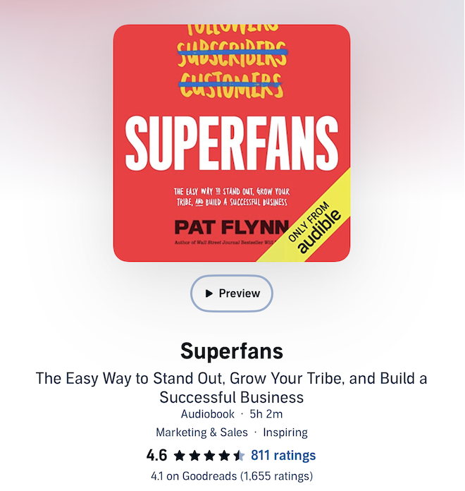

I just finished listening to [Superfans by Pat Flynn](https://patflynn.com/book/superfans/). It's a great book for teaching the strategy involved in getting people to not just buy your products, but buy into a fandom around your company or brand.

I actually learned a lot from this book, so much so that I'm legitimately planning a total overhaul of my website based on some of the ideas I picked up. It's also written in a relaxed, entertaining, narrative style, and Pat Flynn reads his own audiobook. By the end of it you really feel like you're friends with him, which, fittingly, is exactly the kind of connection he teaches you to build with your own audience!

The book walks through the stages of building a brand: getting started, managing customers, getting existing customers to like you even more, and finally turning them into superfans. Throughout all of these stages, I noticed a pattern: the main goal is always to focus on the customer.

First, to attract customers, you need to make media that actively helps them. Then, to get them to come back, you need to connect with them as a person, not a number. And finally, to keep them long term, you need to make them feel involved. The focus throughout is on "you" and "us together", but never "me".

Let me actually try this out. Up until now, I've been writing book reviews about what I learned from the book, but according to Superfans, the better strategy is to write an article that helps you the reader! Ok, so here is my one tidbit of advice for you that I learned from this book:

> If you want to build a loyal fanbase, focus on helping your customers and making them feel involved.

I certainly could use this advice myself (am I making this about me too much?). Moving forward I am going to start employing this. For example, every book review I've done up to this point was about what I learned from the book, which I am only doing because I thought that people would be interested in a new perspective instead of just a summary of the book that ChatGPT could give you in 5 seconds. But now I think that the better approach would, in fact, be to give you a summary of the book, then just use my personal bonus insights as a cherry on top.

Overall I really liked this book! I am going to start employing the strategies I learned from it in this website moving forward. I highly recommend it!