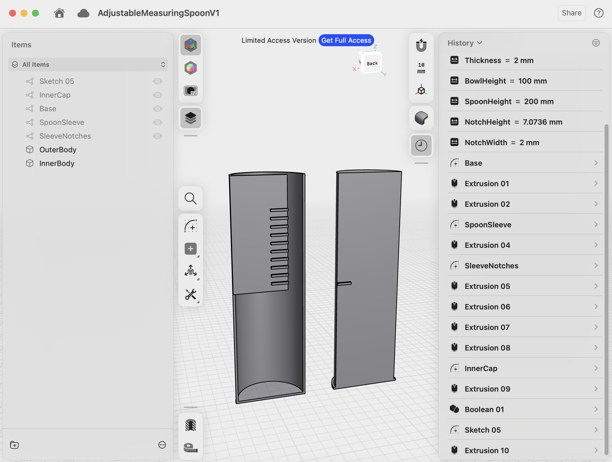

# Project Zero Inventory
## Week 2
### The Build

- Brief recap of last week.
- This week we begin building the first products.

### Workshop

- Introduce Josh.
- Josh has an awesome garage that he converted into a makerspace.
- 3D printer, CNC, woodworking equipment, electronics, etc.
- He is letting me use his 3D printer while I test out this business model.

### Learning CAD

- Before I can print anything, I first need to design it.
- I am completely new to CAD software, so this was my first time learning how to model parts.
- I started with Fusion 360.
- It is incredibly powerful, but I found it to be more complicated than I needed for simple product design.
- I switched to Shapr3D and immediately liked the workflow much better.
- I learned Shapr3D from this excellent YouTube series:
  https://youtube.com/playlist?list=PL9wNxqBnLSFt8AhqsqPGRvHevjG5aX0eP&si=spq01pSJyCRauMum

### The First Product

- The first product I decided to build is an adjustable measuring spoon.
- It is a very simple two-part design that uses basic geometric shapes.
- That makes it a perfect first project for learning CAD and 3D printing.
- I actually built a version of this product a while back, and now I want to redesign it from scratch using everything I've learned.

- Overall I'm happy with the design and excited to see how it performs once it's printed.

### Looking Ahead

- Yesterday I also met up with my friend Don.
- Don is an incredibly talented 3D modeler and has his own website:
  https://www.donbalanzat.com/
- He introduced me to an AI-powered CAD tool called Zoo:
  https://zoo.dev/
- Next week I want to compare my manually designed model against one generated with AI and see how well the two approaches stack up.
- Hopefully I'll also have my first printed prototypes to show!