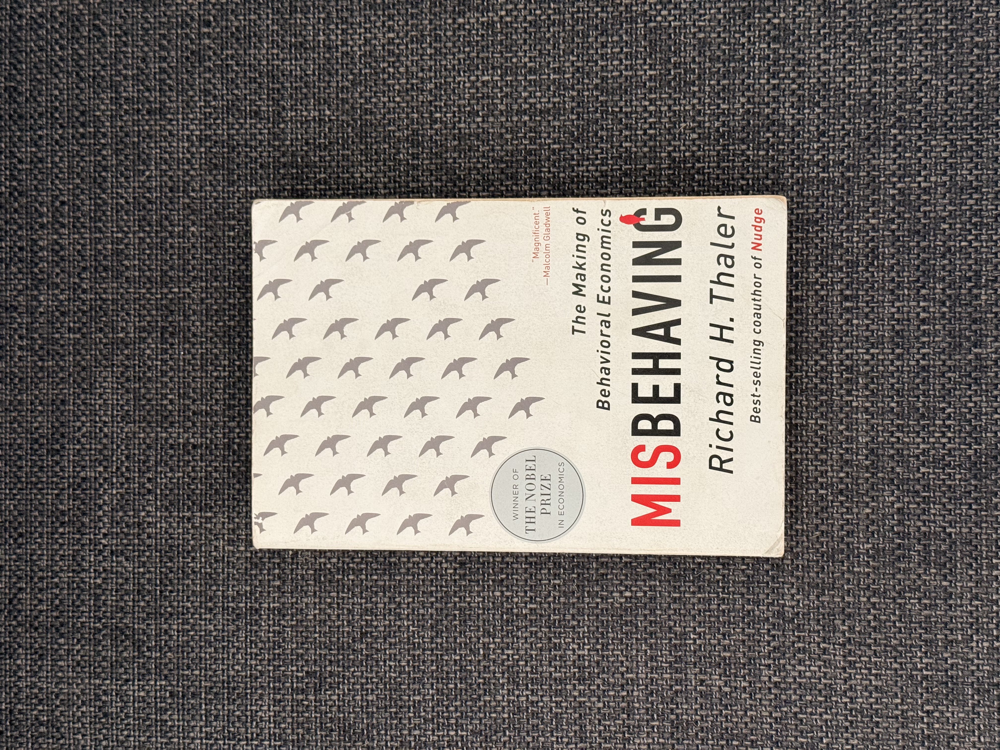

I recently finished reading ["Misbehaving: The Making of Behavioral Economics"](https://www.amazon.com/Misbehaving-Behavioral-Economics-Richard-Thaler/dp/039335279X), written by Economics Nobel Prize winner Richard Thaler. This book is a dive into the world of Behavioral Economics, which is basically the study of how people's behavior often deviates from what traditional economic theories would predict. While this book focuses on economics, I found a lot of the insights are directly relevant to some of my old physics research.

The book is well-written, occasionally humorous, and written in a first person narrative style explaining both the history of the field as well as the ideas behind some of the key concepts. Its an extremely fun read, both because the writing is engaging and because the content is fascinating. To give you a taste of what I mean, heres a quote from the book I found amusing:
> The technical term for discounting of this general form that starts out high and then declines is *quasi-hyperbolic discounting*. If you don't know what "hyperbolic" means, that shows good judgement on your part in what words to incorporate in your vocabulary.

The main idea of Behavioral Economics is simple: when facing common economic decisions, people often behave irrationally compared to what traditional economic theories would predict. To highlight this point the author introduces the concept of an "econ", where an econ is a hypothetical person who makes all of their decisions exactly according to what traditional economics textbooks say to do. Then the author walks us through many real world examples showing that people on average tend to make decision that are different from what an econ would do. And let me just say that its not just strange edge case scenarios where the outcome doesn't matter, but he actually shows common real life scenarios where people are leaving huge amounts of money on the table by making suboptimal decisions.

Ill give one example from the book to illustrate the point, then I want to discuss how this relates to physics. The most memorable example from the book of people "misbehaving" is related to trading players in sports. Basically the author at one point was hired to do a report for a NFL team on how to value draft picks when trading players.
> We made another interesting discovery about the market for picks. Sometimes teams will trade a pick in this year's draft for a pick next year. What is the exchange rate for such trades? Even a casual look at the data reveals that a simple rule of thumb is used for such trades: a pick in a given round this year fetches a pick one round earlier the following year. Give up a third-round pick this year and you can get a second-round pick next year. (Detailed analyses confirm that trades closely follow this rule.) This rule of thumb does not sound unreasonable on the surface, but we found that it implies that teams are discounting the future at 136% per year! Talk about being present-biased! You can borrow at better rates from a loan shark. Not surprisingly, smart teams have figured this out and are happy to give up a pick this year to get a higher-round pick the following year.
He goes on to say that teams will frequently trade away draft picks for players, and that this sort of trade is almost always a bad deal for the team trading away the draft picks. Any Suns fan can tell you just how painful this can be firsthand, after our whole Kevin Durant saga. But the crazy part is that these teams are losing millions of dollars on bad trades, yet they do it anyway! The author goes on to explain why the incentive structures for coaches and managers are not aligned with long term team success, but the main point is much simpler: people are often bad at making decisions, even when there is a lot of money on the line.

What does this mean for economics? Is traditional economic theory wrong? No, it just serves a different purpose. Traditional economic theory is great for providing a baseline framework for understanding how markets work and what the optimal decisions are for various scenarios. Behavioral economics is great for explaining why empirical data often deviates from predictions. If I am buying a house, traditional economics can help me find the best way to finance it, but if I am speculating on the housing market, behavioral economics can help me predict how the market will react to various news and events. Both are useful, but they serve different purposes.

Now lets tie this into physics. This gets into the whole idea of modeling complex system behavior. When modeling complex systems, we often have to make simplifying assumptions to make the problem tractable (see my post on [Spherical Cows](https://shep4.com/blog/2026/06/spherical-cows/)). This gives us a rough idea of how to make predictions about the system, but it frequently will miss details. We start with an ideal model then fill in the gaps with empirical data. I can tell you from personal experience that experiments in biophysics often give results that are very different from the results we hope to get! It was interesting seeing this same phenomenon that I experienced in my research being described in the context of economics.

Overall, I highly recommend this book!
