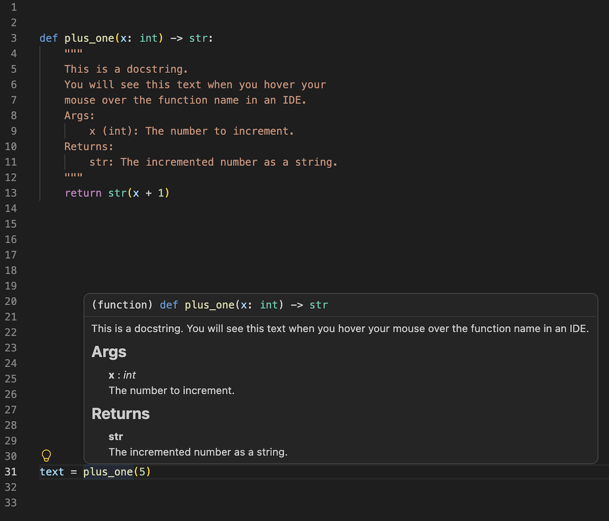

Here I discuss Programming Principles. Today I discuss the principle of Clarity Over All.

## Introduction

For every program that a person might want to write, there are an infinite number of ways to write it. So which way is the best? It depends on context: if you are prototyping something then you might prioritize speed of development, if you are writing a high performance library then you might prioritize performance, if you are writing a program in the early days of computing when memory was limited then you might prioritize shorter code. But in general, the best way to write a program is to write it in a way that makes it easy to understand.

"Clarity Over All" is a principle that states that when writing code, clarity should be prioritized over all other considerations. This means that code should be written in a way that is easy to read and understand, even if it means sacrificing performance or brevity.

## Why Clarity Matters

> Code is read more often than it is written. - Guido van Rossum (Creator of Python)

First, if you write a program that actually does something useful, then it will be read by other people. When these other people read it, they will want to understand what it does and how it works. Our job is to make it as easy as possible for them to do that.

Second, if you write a program that people actually use for a long time, then you and others will have to maintain it. It doesnt matter how well you know the codebase when you write it, at sometime down the line you will have to come back to it to make changes. If you write code that is hard to understand, then it will be hard to maintain. If you write code that is easy to understand, then it will be easy to maintain.

The bottom line is that if you plan to write useful code, then you need to make it easy to understand. I'm not talking about one off scripts that you write and execute one time, for those you can write it however you want. But for anything that you actually want to make an impact with, you need to write it in a way that is easy to understand.

Write Code for Humans to Read.


## How to Write Clear Code

I will break this guideline into 5 categories: Comments, Docs & Docstrings, Naming Conventions, Explicit Code, and File Organization. Each of these categories has its own set of guidelines that can help you write clear code.

### Comments

Don't buy into the idea that "the code explains itself." That misses the point. If I need to quickly understand what a program does, I don't want to spend several minutes reading through it line by line. I want to be able to read a summary of what is happening. Comments provide that summary, and for that reason I believe every program should have comments placed throughout the codebase explaining what is going on.

When writing comments, I recommend focusing on explaining **why** rather than **what**. The overall purpose of a block of code is usually much more valuable than describing each individual line, since if I need the implementation details I can always read the code itself. I also like to separate my code into logical blocks and place a short comment at the top of each block explaining what it does. This makes it much easier to skim through a file and quickly understand its overall structure.

Ultimately, the goal is to write programs that can be understood simply by reading the comments. If someone can skim the comments from top to bottom and come away with a good understanding of how the program works, then you've done a good job.

### Docs & Docstrings

For larger projects, you should aim to have some form of documentation. With modern AI programming assistants capable of generating documentation in seconds, there really isn't much of an excuse anymore.

Documentation is typically a separate file, usually written in Markdown, that explains what your program does and how to use it. Good documentation should include example code showing the expected inputs and outputs, allowing someone to get started quickly without having to dig through the source code. Just like comments, the goal is to explain **why** rather than simply **what** or **how**. Good documentation is concise and precise—it tells the reader everything they need to know, but nothing more.

Next, let's talk about **docstrings**. Docstrings are extremely useful! I get the feeling that a lot of programmers either don't know about them or don't take full advantage of them.

A docstring is a special type of comment placed at the top of a function, class, or module that explains what it does. Unlike regular comments, docstrings are understood by your IDE (Integrated Development Environment), allowing you to quickly see information about a function, its parameters, and its return value without ever opening the file.

Below is an example of a Python docstring and how it appears inside VS Code.



This is an incredibly useful feature because it lets you understand how to use a function without having to read its implementation. While I've shown an example in Python, many other programming languages have similar documentation systems built directly into their development tools.


### Naming Conventions

One of the easiest ways to improve the readability of your code is to choose descriptive names for your variables, functions, and classes. Avoid abbreviations unless they are widely understood, and try to follow the naming conventions of the programming language you're using. For example, in Python it's conventional to use `snake_case` for variables and functions, and `CamelCase` for classes.

Beyond following language conventions, I also recommend developing a consistent naming convention of your own. Personally, I like to put the base name of an object first, followed by its description, so that similar objects naturally group together. For example, instead of `big_dog` and `small_dog`, I would write `dog_big` and `dog_small`. This isn't a standard convention, and you certainly don't have to adopt it. The important part is choosing a convention that makes sense to you and then using it consistently throughout your codebase.

### Explicit Code

Python makes it very easy to pack a lot of logic into a single line of code, but just because you can doesn't mean you should. In general, code is much easier to understand when it is straightforward and explicit rather than clever and implicit. Whenever possible, try to break complex operations into small logical steps.

For example, consider the following two implementations of the same function:

```python
# Clever and implicit
def can_purchase_item(price, discount, tax_rate, credit_limit):
    if price * (1 - discount) * tax_rate > credit_limit:
        return False
    else:
        return True
```

```python
# Straightforward and explicit
def can_purchase_item(price, discount, tax_rate, credit_limit):
    discounted_price = price * (1 - discount)
    total_price = discounted_price * tax_rate
    if total_price > credit_limit:
        return False
    else:
        return True
```

Even without comments, the second example is much easier to understand because each line performs a single logical step. The reader doesn't have to mentally unpack the entire calculation before understanding what the code is doing.

Writing explicit code does add a small amount of overhead, but in practice that cost is almost always negligible compared to the time you save when reading, debugging, or modifying the code later.


### File Organization

Finally, let's zoom out and look at the project as a whole. Organizing your files in a logical way is just as important as organizing the code inside them. Every programming language and ecosystem has its own conventions for project structure, so I recommend following the conventions of the language you're using whenever possible. More importantly, be consistent.

Some common directories that you'll see across many projects include:

- `utils` or `helpers` for utility functions that are used throughout the codebase.
- `tests` for unit tests.
- `docs` for documentation.
- `src` for the core source code of the project.
- `scripts` for programs that automate tasks or run parts of the project.
- `assets` for images, videos, and other media files.

The goal is to make your project predictable. Someone should be able to guess where a file lives before they search for it. A well-organized project makes it much easier for both you and others to navigate the codebase and quickly find what you're looking for.

## Conclusion

By now, I hope I've convinced you that clarity is one of the most important qualities of good code. I've also shared some practical guidelines that I hope will help you write code that is easier to understand and maintain. If you follow these principles, I think you'll save yourself an enormous amount of time and frustration in the future. Your teammates will appreciate it, your users will benefit from it, and perhaps most importantly, your future self will thank you for it.

I wish I could send this article back in time to myself ten years ago, because man, I'm still trying to figure out what some of my old programs do!
