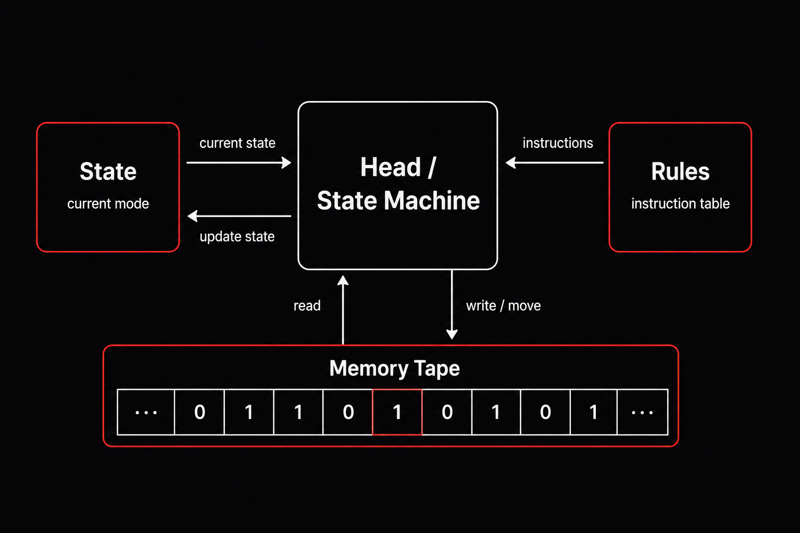
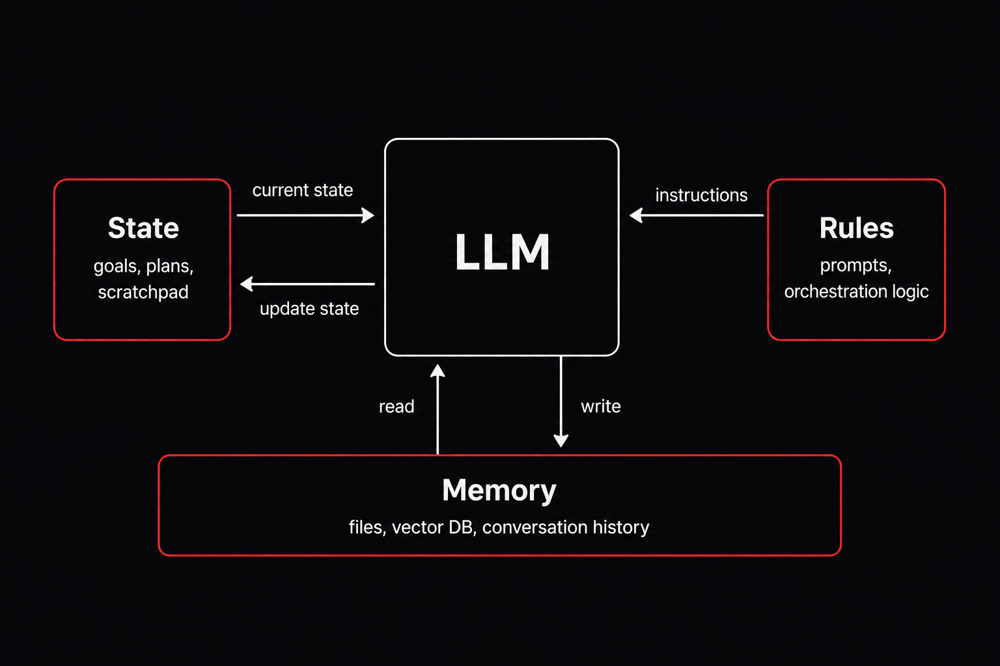

In a previous post, [Turing Incomplete AI](https://shep4.com/blog/2025/02/turing-incomplete-ai/), I discussed how the transformer architecture that underlies much of modern AI is not Turing Complete and why this is an important limitation. Here I want to clarify an important distinction: while transformer models themselves may not be Turing Complete, larger AI Agent systems built around them often can be.

But, as I will show, while AI Agents can be Turing Complete, there is a catch which gets to the heart of questions regarding general intelligence.

First let's review what it means to be Turing Complete and why it matters for AI.

## What is a Turing Machine?

What is a Turing Machine and what does it mean to be Turing Complete? We know that a computer is a type of Turing Machine, but what exactly does that mean?

At a high level, a Turing Machine is a system that solves problems step by step. Instead of solving a problem all at once, it breaks computation into a sequence of small updates performed one after another. The power of a Turing Machine comes from the fact that it only needs to keep track of its current state and memory at any given moment. Even extremely long and complicated computations can be broken into small local updates performed one step at a time.

Computation in a Turing Machine begins with some initial memory and a set of instructions. At each step, the machine reads its current memory and internal state, applies its instruction rules, updates itself, and then repeats the process again. Over time, these small local updates accumulate into increasingly complex computation.

A Turing Machine consists of a few key components:

- **Memory**
  
  A Turing Machine needs some form of persistent memory where information can be stored and updated over time. In the original formulation this memory was represented as a tape, but in modern computers it could be RAM, files on disk, or even neural connections in a brain. This memory allows the machine to keep notes about previous computations instead of recomputing everything from scratch each step.

- **State**
  
  A Turing Machine also has an internal state representing what it is currently doing. This state determines how the machine behaves at the current step of computation. In simpler terms, the state is the machine’s “current mode of operation.”

- **Instruction Rules**
  
  The machine follows a set of rules that determine how it updates itself. At each step, it reads its current memory and state, then decides what to do next. For example, the rules may tell the machine to write new information to memory, move to a new memory location, change its internal state, or continue the computation process.

- **Iterative Execution**
  Most importantly, the machine repeats this process over and over until some stopping criteria. Each step updates the system slightly, gradually building more complex computation over time. This iterative structure is what allows simple local operations to eventually produce arbitrarily complex behavior.

When a system contains all of these components, we say it is *Turing complete*. In other words, it has all the necessary ingredients required to perform arbitrary computation in principle.

## Why Transformers Are Not Turing Complete

In [Turing Incomplete AI](https://shep4.com/blog/2025/02/turing-incomplete-ai/), I explored this topic in detail, so I will keep this section brief. Basically, the transformer architecture lacks the persistent **memory** and continuously evolving **state** required for Turing Completeness.

In other words, a transformer model processes a finite context window, produces an output, and then stops. While it can temporarily reason over information within its context window, it does not naturally maintain long-term writable memory or iterative computational state across arbitrarily long computations. This limits its ability to perform computations that continuously build on previous results over time, which is a key requirement for Turing Completeness.

## How AI Agents Can Be Turing Complete

Recently, a new class of AI systems known as AI Agents has started to emerge. An AI Agent is generally a system where a transformer based language model is combined with memory, tools, and execution logic that allow it to perform actions over time.

This is important because while the transformer model itself may not be Turing Complete, AI Agents often add many of the missing components required to construct a Turing Machine.

For example, an AI Agent may include:
- persistent memory through files, databases, or conversation history,
- internal state such as goals, plans, or prompt templates,
- instruction rules defined by prompts or orchestration logic,
- iterative execution loops which repeatedly call the model over time until some stopping criteria is met.

Instead of running once and stopping, an AI Agent can repeatedly:
1. read from memory,
2. evaluate its current state,
3. generate new outputs,
4. update its memory,
5. and continue the computation process.

This transforms the model from a single inference step into part of a larger persistent computational system. In other words, while the transformer itself may not be Turing Complete, the overall AI Agent system built around it often can be.

## The Important Caveat

At this point, it may sound like AI Agents solve the limitations of transformer models entirely. But there is an important catch.

While modern AI Agents can be Turing Complete, they have to be pre-programmed. The memory systems, execution loops, prompts, orchestration logic, and tool interfaces are designed externally by programmers rather than learned autonomously by the model itself.

This is not necessarily a weakness. Traditional computers work the same way: a CPU may be capable of arbitrary computation, but software still needs to be written for it. However, this differs from the idea of a truly intelligent system which could autonomously learn new computational structures, memory systems, and algorithms on its own.

In other words, the ability to *execute* arbitrary computation is not necessarily the same thing as the ability to *learn* arbitrary computation.

## Conclusion

When I first realized that modern AI Agents can be Turing Complete, I actually found it extremely exciting! Agentic systems are not just clever prompt engineering tricks layered on top of language models. They are potentially universal computational systems capable of performing arbitrarily complex algorithms through the combination of memory, tools, state, and iterative execution. This gave me a newfound respect for AI Agents as a computational paradigm.

At the same time, I think this distinction also provides a useful mental model for thinking about the difference between Turing Machines and truly intelligent systems. A Turing Machine can follow rules and execute arbitrary computation, but intelligence may require something deeper: the ability to autonomously construct new computational structures, algorithms, and representations without those systems being explicitly engineered in advance.

In that sense, modern AI Agents may not represent the end of the story, but they may represent the beginning of a very important new chapter.